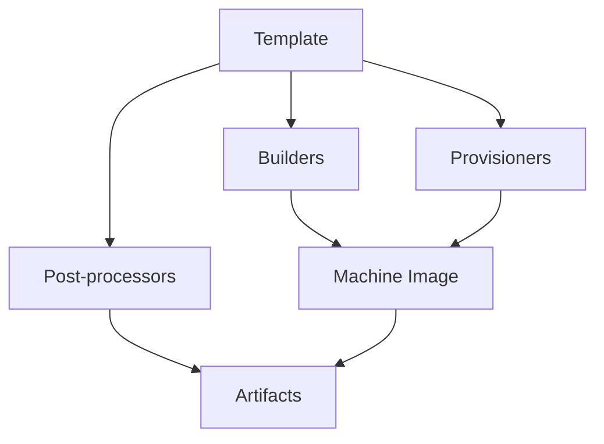

# Packer: Automação de Imagens de Máquina para Infraestrutura como Código


O HashiCorp Packer é uma ferramenta de código aberto para criar imagens de máquina idênticas para múltiplas plataformas a partir de uma única configuração de origem. Este guia abrange desde conceitos fundamentais até implementações avançadas e integração com Terraform.

## O que é o Packer?

### Definição e propósito

Packer é uma ferramenta comunitária leve, multi-plataforma e altamente performática que automatiza a criação de imagens de máquina (machine images). Ele não substitui ferramentas de gerenciamento de configuração como Chef, Puppet ou Ansible, mas pode usá-las durante o processo de construção de imagens.

### Conceitos fundamentais

**Machine Image (Imagem de Máquina)**
- Unidade estática única contendo sistema operacional pré-configurado e software instalado
- Usada para criar rapidamente novas máquinas em execução
- Formatos variam por plataforma: AMIs (EC2), VMDK/VMX (VMware), OVF (VirtualBox)

**Golden Images**
- Imagens base padronizadas e versionadas
- Contêm configurações de segurança, software essencial e configurações corporativas
- Base para pipelines de imagem automatizados

### Benefícios principais

1. **Consistência**: Imagens idênticas em múltiplas plataformas
2. **Velocidade**: Deploy rápido usando imagens pré-configuradas
3. **Confiabilidade**: Reduz erros de configuração manual
4. **Versionamento**: Controle de versão de imagens
5. **Automação**: Integração com pipelines CI/CD
6. **Compliance**: Aplicação consistente de políticas de segurança

## Arquitetura do Packer

### Componentes principais



#### **1. Templates (Modelos)**
- Arquivos de configuração definindo como construir imagens
- Formato HCL2 (recomendado) ou JSON (legacy)
- Contêm declarações e comandos para o Packer

#### **2. Builders (Construtores)**
- Criam máquinas e geram imagens para várias plataformas
- Cada builder é específico para uma plataforma (AWS, Azure, GCP, etc.)
- Gerenciam recursos temporários necessários

#### **3. Provisioners (Provisionadores)**
- Instalam e configuram software na imagem da máquina
- Executam após boot e antes da finalização da imagem
- Tipos: shell, PowerShell, file, Ansible, Chef, Puppet

#### **4. Post-processors (Pós-processadores)**
- Executam após builders e provisioners
- Realizam tarefas como upload, compressão, validação
- Opcionais e encadeáveis

### Fluxo de execução

1. **Inicialização**: Packer lê o template e baixa plugins necessários
2. **Validação**: Verifica sintaxe e configurações
3. **Build**: 
   - Builder cria e inicia máquina temporária
   - Provisioners configuram a máquina
   - Builder captura imagem da máquina configurada
   - Máquina temporária é destruída
4. **Post-processamento**: Executa ações adicionais nos artefatos
5. **Finalização**: Retorna informações sobre artefatos criados

## Templates Packer em HCL2

### Estrutura básica de um template

```hcl
# Configurações do Packer e plugins
packer {
  required_version = ">= 1.8.0"
  required_plugins {
    amazon = {
      version = ">= 1.2.8"
      source  = "github.com/hashicorp/amazon"
    }
  }
}

# Variáveis
variable "ami_prefix" {
  type        = string
  default     = "my-custom-ami"
  description = "Prefixo para nome da AMI"
}

# Dados locais
locals {
  timestamp = regex_replace(timestamp(), "[- TZ:]", "")
  ami_name  = "${var.ami_prefix}-${local.timestamp}"
}

# Fonte (builder + communicator)
source "amazon-ebs" "ubuntu" {
  ami_name      = local.ami_name
  instance_type = "t3.micro"
  region        = "us-east-1"
  
  source_ami_filter {
    filters = {
      name                = "ubuntu/images/*ubuntu-jammy-22.04-amd64-server-*"
      root-device-type    = "ebs"
      virtualization-type = "hvm"
    }
    most_recent = true
    owners      = ["099720109477"] # Canonical
  }
  
  ssh_username = "ubuntu"
  
  tags = {
    Name         = local.ami_name
    Environment  = "production"
    OS_Version   = "Ubuntu 22.04"
    Base_AMI     = "{{ .SourceAMI }}"
    Build_Time   = "{{ isotime }}"
  }
}

# Build (orchestração)
build {
  name = "ubuntu-web-server"
  sources = [
    "source.amazon-ebs.ubuntu"
  ]
  
  # Provisioners
  provisioner "shell" {
    inline = [
      "echo 'Atualizando sistema...'",
      "sudo apt-get update",
      "sudo apt-get upgrade -y"
    ]
  }
  
  provisioner "file" {
    source      = "configs/"
    destination = "/tmp/"
  }
  
  provisioner "shell" {
    script = "scripts/install-web-server.sh"
  }
  
  # Post-processors
  post-processor "manifest" {
    output = "manifest.json"
    strip_path = true
  }
}
```

### Bloco Packer

```hcl
packer {
  required_version = ">= 1.8.0"
  
  required_plugins {
    # Plugin mantido pela HashiCorp
    amazon = {
      version = ">= 1.2.8"
      source  = "github.com/hashicorp/amazon"
    }
    
    # Plugin da comunidade
    ansible = {
      version = ">= 1.0.0"
      source  = "github.com/hashicorp/ansible"
    }
  }
}
```

### Variáveis e funções

```hcl
# Variáveis de input
variable "region" {
  type        = string
  default     = "us-east-1"
  description = "Região AWS para criar a AMI"
  
  validation {
    condition     = can(regex("^[a-z]{2}-[a-z]+-[0-9]$", var.region))
    error_message = "Região deve estar no formato correto (ex: us-east-1)."
  }
}

variable "instance_types" {
  type = list(string)
  default = ["t3.micro", "t3.small"]
  description = "Lista de tipos de instância suportados"
}

variable "environment" {
  type = string
  default = "dev"
  
  validation {
    condition     = contains(["dev", "staging", "prod"], var.environment)
    error_message = "Environment deve ser: dev, staging ou prod."
  }
}

# Locals para processamento
locals {
  timestamp = regex_replace(timestamp(), "[- TZ:]", "")
  
  common_tags = {
    Project     = "MyApp"
    Environment = var.environment
    BuildDate   = formatdate("YYYY-MM-DD", timestamp())
    Terraform   = "true"
  }
  
  ami_name = "${var.environment}-web-server-${local.timestamp}"
}

# Usando dados externos
data "http" "myip" {
  url = "https://api.ipify.org"
}

locals {
  my_ip = "${chomp(data.http.myip.body)}/32"
}
```

## Builders por Plataforma

### AWS (Amazon EBS)

```hcl
source "amazon-ebs" "web-server" {
  # Configurações básicas
  ami_name      = "web-server-${local.timestamp}"
  instance_type = "t3.micro"
  region        = var.region
  
  # Seleção da AMI base
  source_ami_filter {
    filters = {
      name                = "amzn2-ami-hvm-*-x86_64-gp2"
      root-device-type    = "ebs"
      virtualization-type = "hvm"
    }
    most_recent = true
    owners      = ["amazon"]
  }
  
  # Configurações de rede
  vpc_id    = data.aws_vpc.default.id
  subnet_id = data.aws_subnet.public.id
  
  security_group_ids = [aws_security_group.packer.id]
  
  # SSH
  ssh_username                = "ec2-user"
  ssh_interface              = "public_ip"
  ssh_timeout               = "5m"
  associate_public_ip_address = true
  
  # EBS
  ebs_optimized = true
  
  launch_block_device_mappings {
    device_name           = "/dev/xvda"
    volume_type          = "gp3"
    volume_size          = 20
    throughput           = 125
    iops                 = 3000
    delete_on_termination = true
    encrypted            = true
  }
  
  # Tags
  tags = merge(local.common_tags, {
    Name = "Packer Build - Web Server"
    Type = "Golden Image"
  })
  
  run_tags = merge(local.common_tags, {
    Name = "Packer Builder Instance"
  })
  
  snapshot_tags = merge(local.common_tags, {
    Name = "Packer Snapshot"
  })
}

# Multiple builders para diferentes regiões
source "amazon-ebs" "multi-region" {
  for_each = toset(["us-east-1", "us-west-2", "eu-west-1"])
  
  ami_name      = "web-server-${each.key}-${local.timestamp}"
  region        = each.key
  instance_type = "t3.micro"
  
  source_ami_filter {
    filters = {
      name = "ubuntu/images/*ubuntu-jammy-22.04-amd64-server-*"
      root-device-type = "ebs"
      virtualization-type = "hvm"
    }
    most_recent = true
    owners = ["099720109477"]
  }
  
  ssh_username = "ubuntu"
}
```

### Azure (ARM)

```hcl
source "azure-arm" "web-server" {
  # Autenticação
  use_azure_cli_auth = true
  
  # Localização e configuração
  subscription_id = var.azure_subscription_id
  location        = "East US"
  
  # Imagem base
  image_offer     = "0001-com-ubuntu-server-jammy"
  image_publisher = "Canonical"
  image_sku      = "22_04-lts-gen2"
  
  # Configurações de build
  vm_size = "Standard_B2s"
  
  # Resource group (será criado temporariamente)
  managed_image_resource_group_name = "packer-images-rg"
  managed_image_name                = "web-server-${local.timestamp}"
  
  # Rede
  virtual_network_name = "packer-vnet"
  virtual_network_subnet_name = "packer-subnet"
  virtual_network_resource_group_name = "packer-network-rg"
  
  # SSH
  ssh_username = "packer"
  
  # Tags
  azure_tags = {
    Environment = var.environment
    BuildTool   = "Packer"
    BuildDate   = local.timestamp
  }
}
```

### Google Cloud Platform

```hcl
source "googlecompute" "web-server" {
  # Projeto e zona
  project_id = var.gcp_project_id
  zone       = "us-central1-a"
  
  # Configurações da instância
  machine_type = "e2-micro"
  
  # Imagem base
  source_image_family = "ubuntu-2204-lts"
  source_image_project_id = ["ubuntu-os-cloud"]
  
  # Configurações da imagem resultante
  image_name        = "web-server-${local.timestamp}"
  image_family      = "web-server"
  image_description = "Custom web server image built with Packer"
  
  # Rede
  network    = "default"
  subnetwork = "default"
  
  # SSH
  ssh_username = "packer"
  
  # Disco
  disk_size = 20
  disk_type = "pd-standard"
  
  # Labels
  image_labels = {
    environment = var.environment
    build_tool  = "packer"
    build_date  = replace(local.timestamp, ".", "-")
  }
  
  # Metadados
  metadata = {
    enable-oslogin = "FALSE"
  }
}
```

### Docker

```hcl
source "docker" "nginx" {
  image  = "ubuntu:22.04"
  commit = true
  
  changes = [
    "EXPOSE 80",
    "EXPOSE 443",
    "CMD [\"/usr/sbin/nginx\", \"-g\", \"daemon off;\"]",
    "ENTRYPOINT [\"/entrypoint.sh\"]"
  ]
  
  run_command = [
    "-d", "-i", "-t",
    "--name", "packer-nginx",
    "{{.Image}}",
    "/bin/bash"
  ]
}

# Multi-stage Docker build
source "docker" "builder" {
  image = "node:18-alpine"
  commit = false
  export_path = "app.tar"
}

source "docker" "runtime" {
  image = "nginx:alpine"
  commit = true
}
```

### VMware vSphere

```hcl
source "vsphere-iso" "web-server" {
  # Conexão vSphere
  vcenter_server      = var.vsphere_server
  username           = var.vsphere_username
  password           = var.vsphere_password
  insecure_connection = true
  
  # Localização
  datacenter = "Datacenter"
  cluster    = "Cluster"
  datastore  = "datastore1"
  folder     = "packer-templates"
  
  # VM Configuration
  vm_name       = "web-server-template"
  guest_os_type = "ubuntu64Guest"
  
  CPUs      = 2
  RAM       = 4096
  RAM_reserve_all = true
  
  # Storage
  storage {
    disk_size             = 32768
    disk_thin_provisioned = true
  }
  
  # Network
  network_adapters {
    network      = "VM Network"
    network_card = "vmxnet3"
  }
  
  # ISO
  iso_paths = [
    "[datastore1] ISOs/ubuntu-22.04.1-desktop-amd64.iso"
  ]
  
  # Boot
  boot_command = [
    "<enter><wait10><f6><esc>",
    "<bs><bs><bs><bs><bs><bs><bs><bs><bs><bs>",
    "<bs><bs><bs><bs><bs><bs><bs><bs><bs><bs>",
    "<bs><bs><bs><bs><bs><bs><bs><bs><bs><bs>",
    "<bs><bs><bs><bs><bs><bs><bs><bs><bs><bs>",
    "<bs><bs><bs><bs><bs><bs><bs><bs><bs><bs>",
    "console-setup/ask_detect=false ",
    "keyboard-configuration/layoutcode=us ",
    "ubuntu-server/install/minimal ",
    "grub-installer/bootdev=/dev/sda<wait> ",
    "noprompt --<enter>"
  ]
  
  # SSH
  ssh_username = "ubuntu"
  ssh_password = "ubuntu"
  ssh_wait_timeout = "30m"
}
```

## Provisioners Detalhados

### Shell Provisioner

```hcl
# Shell básico
provisioner "shell" {
  inline = [
    "echo 'Starting provisioning...'",
    "sudo apt-get update",
    "sudo apt-get install -y nginx",
    "sudo systemctl enable nginx"
  ]
}

# Shell com script externo
provisioner "shell" {
  script = "scripts/install-docker.sh"
  environment_vars = [
    "DEBIAN_FRONTEND=noninteractive",
    "DOCKER_VERSION=20.10.21"
  ]
}

# Shell com múltiplos scripts
provisioner "shell" {
  scripts = [
    "scripts/base-packages.sh",
    "scripts/security-hardening.sh",
    "scripts/monitoring-agent.sh"
  ]
  pause_before = "30s"
  timeout      = "10m"
}

# Shell condicional
provisioner "shell" {
  only = ["amazon-ebs.production"]
  inline = [
    "echo 'Production-specific configuration'",
    "sudo ufw enable",
    "sudo fail2ban-client start"
  ]
}

# Shell com templating
provisioner "shell" {
  inline_shebang = "/bin/bash -e"
  inline = [
    "echo 'AMI: {{.SourceAMI}}'",
    "echo 'Region: {{.BuildRegion}}'",
    "echo 'Instance ID: {{.BuildInstanceId}}'",
    "echo 'Build time: {{isotime \"2006-01-02 15:04:05\"}}'"
  ]
}
```

### File Provisioner

```hcl
# Upload de arquivo único
provisioner "file" {
  source      = "configs/nginx.conf"
  destination = "/tmp/nginx.conf"
}

# Upload de diretório
provisioner "file" {
  source      = "webapp/"
  destination = "/tmp/"
}

# Download de arquivo da máquina
provisioner "file" {
  direction   = "download"
  source      = "/var/log/build.log"
  destination = "logs/build-${local.timestamp}.log"
}

# Upload com template
provisioner "file" {
  content = templatefile("templates/config.tpl", {
    environment = var.environment
    version     = var.app_version
    region      = var.region
  })
  destination = "/tmp/app.conf"
}
```

### PowerShell Provisioner (Windows)

```hcl
provisioner "powershell" {
  inline = [
    "Write-Host 'Installing IIS...'",
    "Enable-WindowsOptionalFeature -Online -FeatureName IIS-WebServerRole -All",
    "Set-Service -Name W3SVC -StartupType Automatic"
  ]
}

# PowerShell com script
provisioner "powershell" {
  script = "scripts/install-chocolatey.ps1"
  elevated_user     = "Administrator"
  elevated_password = "{{.WinRMPassword}}"
}

# PowerShell com arquivo remoto
provisioner "powershell" {
  scripts = [
    "https://raw.githubusercontent.com/ansible/ansible/devel/examples/scripts/ConfigureRemotingForAnsible.ps1"
  ]
}
```

### Ansible Provisioner

```hcl
provisioner "ansible" {
  playbook_file = "ansible/site.yml"
  inventory_directory = "ansible/inventory"
  
  extra_arguments = [
    "--extra-vars",
    jsonencode({
      environment = var.environment
      app_version = var.app_version
    })
  ]
  
  ansible_env_vars = [
    "ANSIBLE_HOST_KEY_CHECKING=False",
    "ANSIBLE_SSH_ARGS='-o ForwardAgent=yes -o ControlMaster=auto -o ControlPersist=60s'"
  ]
  
  groups = ["webservers", "production"]
  
  user = "ubuntu"
}

# Ansible Local
provisioner "ansible-local" {
  playbook_file = "ansible/local.yml"
  command       = "ansible-playbook"
  
  extra_arguments = [
    "-vvv",
    "--check"
  ]
}
```

### Breakpoint Provisioner (Debug)

```hcl
provisioner "breakpoint" {
  disable = var.debug_mode == false
  note    = "Pause here to inspect the instance manually"
}
```

## Post-processors

### Manifest Post-processor

```hcl
post-processor "manifest" {
  output     = "manifest.json"
  strip_path = true
  
  custom_data = {
    build_time    = "{{isotime}}"
    build_user    = "{{env `USER`}}"
    git_commit    = "{{env `GIT_COMMIT`}}"
    ami_regions   = ["us-east-1", "us-west-2"]
  }
}
```

### Compress Post-processor

```hcl
post-processor "compress" {
  output    = "image-{{.BuildName}}.tar.gz"
  format    = "tar.gz"
  compression_level = 9
  
  keep_input_artifact = true
}
```

### Checksum Post-processor

```hcl
post-processor "checksum" {
  checksum_types = ["sha256", "md5"]
  output         = "checksums.txt"
}
```

### Docker Import/Tag/Push

```hcl
# Import para Docker
post-processor "docker-import" {
  repository = "myapp/webserver"
  tag        = var.app_version
}

# Tag adicional
post-processor "docker-tag" {
  repository = "myapp/webserver"
  tags       = ["latest", "stable", "v${var.app_version}"]
}

# Push para registry
post-processor "docker-push" {
  login          = true
  login_username = var.docker_username
  login_password = var.docker_password
  login_server   = "registry.company.com"
}
```

### Shell-local Post-processor

```hcl
post-processor "shell-local" {
  environment_vars = [
    "IMAGE_ID={{.Artifact}}"
  ]
  
  inline = [
    "echo 'Image created: {{.Artifact}}'",
    "aws ec2 describe-images --image-ids {{.Artifact}}",
    "echo '{{.Artifact}}' > latest-ami.txt"
  ]
}
```

## Builds Paralelos e Múltiplas Plataformas

### Build paralelo multi-região

```hcl
build {
  name = "multi-region-build"
  
  sources = [
    "source.amazon-ebs.us-east-1",
    "source.amazon-ebs.us-west-2", 
    "source.amazon-ebs.eu-west-1"
  ]
  
  # Provisioning comum
  provisioner "shell" {
    inline = [
      "sudo apt-get update",
      "sudo apt-get install -y nginx"
    ]
  }
  
  # Configuração específica por região
  provisioner "shell" {
    only = ["amazon-ebs.us-east-1"]
    inline = ["echo 'US East configuration'"]
  }
  
  provisioner "shell" {
    only = ["amazon-ebs.eu-west-1"]  
    inline = ["echo 'EU West configuration'"]
  }
}
```

### Build multi-plataforma

```hcl
# Sources para diferentes plataformas
source "amazon-ebs" "aws" {
  ami_name      = "myapp-aws-${local.timestamp}"
  instance_type = "t3.micro"
  region        = "us-east-1"
  
  source_ami_filter {
    filters = {
      name = "ubuntu/images/*ubuntu-jammy-22.04-amd64-server-*"
    }
    most_recent = true
    owners = ["099720109477"]
  }
  
  ssh_username = "ubuntu"
}

source "azure-arm" "azure" {
  image_offer     = "0001-com-ubuntu-server-jammy"
  image_publisher = "Canonical"
  image_sku      = "22_04-lts-gen2"
  
  location                          = "East US"
  vm_size                          = "Standard_B2s"
  managed_image_resource_group_name = "packer-images"
  managed_image_name               = "myapp-azure-${local.timestamp}"
  
  ssh_username = "packer"
}

source "googlecompute" "gcp" {
  project_id   = var.gcp_project_id
  zone         = "us-central1-a"
  machine_type = "e2-micro"
  
  source_image_family = "ubuntu-2204-lts"
  image_name          = "myapp-gcp-${local.timestamp}"
  
  ssh_username = "packer"
}

build {
  name = "multi-cloud-build"
  
  sources = [
    "source.amazon-ebs.aws",
    "source.azure-arm.azure",
    "source.googlecompute.gcp"
  ]
  
  # Provisioning comum para todas as plataformas
  provisioner "shell" {
    inline = [
      "sudo apt-get update",
      "sudo apt-get install -y nginx docker.io",
      "sudo systemctl enable nginx docker"
    ]
  }
  
  # Configurações específicas por provedor
  provisioner "shell" {
    only = ["amazon-ebs.aws"]
    inline = [
      "curl -o /tmp/cloudwatch-agent.deb https://s3.amazonaws.com/amazoncloudwatch-agent/ubuntu/amd64/latest/amazon-cloudwatch-agent.deb",
      "sudo dpkg -i /tmp/cloudwatch-agent.deb"
    ]
  }
  
  provisioner "shell" {
    only = ["azure-arm.azure"]
    inline = [
      "curl -sL https://aka.ms/InstallAzureCLIDeb | sudo bash"
    ]
  }
  
  provisioner "shell" {
    only = ["googlecompute.gcp"]
    inline = [
      "curl https://sdk.cloud.google.com | bash",
      "exec -l $SHELL"
    ]
  }
}
```

## Integração com HCP Packer

### Configuração HCP Packer

```hcl
packer {
  required_plugins {
    amazon = {
      version = ">= 1.2.8"
      source  = "github.com/hashicorp/amazon"
    }
  }
}

# HCP Packer configuration
variable "hcp_packer_bucket_name" {
  type        = string
  default     = "webapp-golden-image"
  description = "Nome do bucket no HCP Packer"
}

# Data source para obter imagem versionada
data "hcp-packer-image" "base" {
  bucket_name    = "base-ubuntu"
  channel        = "production"
  cloud_provider = "aws"
  region         = var.region
}

source "amazon-ebs" "webapp" {
  ami_name      = "webapp-${local.timestamp}"
  instance_type = "t3.micro"
  region        = var.region
  
  # Usar imagem do HCP Packer como base
  source_ami = data.hcp-packer-image.base.cloud_image_id
  
  ssh_username = "ubuntu"
  
  tags = {
    Name               = "WebApp Golden Image"
    HCP_Packer_Bucket  = var.hcp_packer_bucket_name
    Base_Image_ID      = data.hcp-packer-image.base.cloud_image_id
    Base_Image_Channel = data.hcp-packer-image.base.channel_name
  }
}

build {
  # HCP Packer registry integration
  hcp_packer_registry {
    bucket_name = var.hcp_packer_bucket_name
    description = "WebApp golden image with latest security patches"
    
    bucket_labels = {
      "team"        = "platform"
      "environment" = var.environment
      "app"         = "webapp"
    }
    
    build_labels = {
      "build-time" = timestamp()
      "git-commit" = "{{env `GIT_COMMIT`}}"
      "os-version" = "ubuntu-22.04"
    }
  }
  
  sources = ["source.amazon-ebs.webapp"]
  
  provisioner "shell" {
    inline = [
      "sudo apt-get update",
      "sudo apt-get upgrade -y",
      "sudo apt-get install -y nginx nodejs npm"
    ]
  }
  
  # SBOM generation
  provisioner "shell" {
    inline = [
      "sudo apt list --installed > /tmp/installed-packages.txt"
    ]
  }
  
  provisioner "hcp-sbom" {
    package_list_file = "/tmp/installed-packages.txt"
    format           = "spdx-json"
  }
}
```

## Templates Avançados

### Template modular com includes

```hcl
# variables.pkr.hcl
variable "region" {
  type    = string
  default = "us-east-1"
}

variable "environment" {
  type = string
  validation {
    condition     = contains(["dev", "staging", "prod"], var.environment)
    error_message = "Environment deve ser: dev, staging ou prod."
  }
}

# locals.pkr.hcl
locals {
  timestamp = regex_replace(timestamp(), "[- TZ:]", "")
  
  common_tags = {
    Environment = var.environment
    BuildDate   = formatdate("YYYY-MM-DD", timestamp())
    BuildTool   = "Packer"
    ManagedBy   = "Terraform"
  }
  
  ami_name = "${var.environment}-webapp-${local.timestamp}"
}

# sources.pkr.hcl
source "amazon-ebs" "webapp" {
  ami_name      = local.ami_name
  instance_type = var.environment == "prod" ? "t3.small" : "t3.micro"
  region        = var.region
  
  source_ami_filter {
    filters = {
      name                = "ubuntu/images/*ubuntu-jammy-22.04-amd64-server-*"
      root-device-type    = "ebs"
      virtualization-type = "hvm"
    }
    most_recent = true
    owners      = ["099720109477"]
  }
  
  ssh_username = "ubuntu"
  
  tags = merge(local.common_tags, {
    Name = local.ami_name
    Type = "WebApp"
  })
  
  run_tags = merge(local.common_tags, {
    Name = "Packer Builder - ${local.ami_name}"
  })
}

# builds.pkr.hcl
build {
  sources = ["source.amazon-ebs.webapp"]
  
  # Base provisioning
  provisioner "shell" {
    scripts = [
      "scripts/update-system.sh",
      "scripts/install-base-packages.sh"
    ]
  }
  
  # Environment-specific provisioning
  provisioner "shell" {
    script = "scripts/configure-${var.environment}.sh"
  }
  
  # Application deployment
  provisioner "file" {
    source      = "webapp/"
    destination = "/tmp/webapp/"
  }
  
  provisioner "shell" {
    script = "scripts/deploy-webapp.sh"
  }
  
  # Security hardening
  provisioner "shell" {
    only   = ["source.amazon-ebs.webapp"]
    script = "scripts/security-hardening.sh"
  }
  
  # Cleanup
  provisioner "shell" {
    inline = [
      "sudo apt-get autoremove -y",
      "sudo apt-get clean",
      "sudo rm -rf /tmp/*",
      "history -c"
    ]
  }
  
  post-processor "manifest" {
    output = "manifest-${var.environment}.json"
  }
}
```

### Template com validação de input

```hcl
# Input validation
variable "allowed_regions" {
  type    = list(string)
  default = ["us-east-1", "us-west-2", "eu-west-1"]
}

variable "region" {
  type = string
  validation {
    condition = contains(var.allowed_regions, var.region)
    error_message = "Região deve ser uma das permitidas: ${join(", ", var.allowed_regions)}."
  }
}

variable "instance_type" {
  type    = string
  default = "t3.micro"
  
  validation {
    condition = can(regex("^[tm][0-9]+\\.(nano|micro|small|medium|large|xlarge)", var.instance_type))
    error_message = "Instance type deve seguir o padrão AWS (ex: t3.micro, m5.large)."
  }
}

variable "app_version" {
  type = string
  validation {
    condition = can(regex("^v[0-9]+\\.[0-9]+\\.[0-9]+$", var.app_version))
    error_message = "App version deve seguir semantic versioning (ex: v1.2.3)."
  }
}

# Conditional logic
locals {
  is_production = var.environment == "prod"
  
  instance_config = {
    dev = {
      instance_type = "t3.micro"
      volume_size   = 20
    }
    staging = {
      instance_type = "t3.small"
      volume_size   = 30
    }
    prod = {
      instance_type = "t3.medium"
      volume_size   = 50
    }
  }
  
  config = local.instance_config[var.environment]
}

source "amazon-ebs" "conditional" {
  ami_name      = "webapp-${var.environment}-${local.timestamp}"
  instance_type = local.config.instance_type
  region        = var.region
  
  ebs_optimized = local.is_production
  
  launch_block_device_mappings {
    device_name           = "/dev/sda1"
    volume_size          = local.config.volume_size
    volume_type          = local.is_production ? "gp3" : "gp2"
    delete_on_termination = true
    encrypted            = local.is_production
  }
  
  source_ami_filter {
    filters = {
      name = "ubuntu/images/*ubuntu-jammy-22.04-amd64-server-*"
    }
    most_recent = true
    owners = ["099720109477"]
  }
  
  ssh_username = "ubuntu"
}
```

## Integração com Terraform

### Usando imagens do Packer no Terraform

```hcl
# Data source para encontrar a AMI mais recente
data "aws_ami" "webapp" {
  most_recent = true
  owners      = ["self"]
  
  filter {
    name   = "name"
    values = ["webapp-prod-*"]
  }
  
  filter {
    name   = "state"
    values = ["available"]
  }
  
  filter {
    name   = "tag:Environment"
    values = ["prod"]
  }
}

# Usando a AMI em uma instância
resource "aws_instance" "webapp" {
  ami           = data.aws_ami.webapp.id
  instance_type = "t3.small"
  subnet_id     = aws_subnet.private.id
  
  vpc_security_group_ids = [
    aws_security_group.webapp.id
  ]
  
  tags = {
    Name        = "WebApp Instance"
    Environment = "production"
    AMI_ID      = data.aws_ami.webapp.id
    AMI_Name    = data.aws_ami.webapp.name
  }
}

# Launch Template usando AMI do Packer
resource "aws_launch_template" "webapp" {
  name_prefix   = "webapp-"
  image_id      = data.aws_ami.webapp.id
  instance_type = "t3.small"
  
  vpc_security_group_ids = [aws_security_group.webapp.id]
  
  user_data = base64encode(templatefile("user-data.sh", {
    environment = "production"
  }))
  
  tag_specifications {
    resource_type = "instance"
    tags = {
      Name = "WebApp ASG Instance"
      AMI  = data.aws_ami.webapp.name
    }
  }
}

# Auto Scaling Group
resource "aws_autoscaling_group" "webapp" {
  name                = "webapp-asg"
  vpc_zone_identifier = aws_subnet.private[*].id
  min_size            = 2
  max_size            = 10
  desired_capacity    = 3
  
  launch_template {
    id      = aws_launch_template.webapp.id
    version = "$Latest"
  }
  
  tag {
    key                 = "Name"
    value               = "WebApp ASG"
    propagate_at_launch = false
  }
}
```

### Pipeline integrado Packer + Terraform

```hcl
# packer-build.tf
resource "null_resource" "packer_build" {
  triggers = {
    packer_template = filesha256("${path.module}/webapp.pkr.hcl")
    app_version     = var.app_version
  }
  
  provisioner "local-exec" {
    command = <<-EOT
      cd ${path.module}
      packer init .
      packer build \
        -var 'app_version=${var.app_version}' \
        -var 'environment=${var.environment}' \
        webapp.pkr.hcl
    EOT
  }
}

# Aguarda o build do Packer antes de buscar a AMI
data "aws_ami" "webapp" {
  depends_on = [null_resource.packer_build]
  
  most_recent = true
  owners      = ["self"]
  
  filter {
    name   = "name"
    values = ["webapp-${var.environment}-*"]
  }
  
  filter {
    name   = "tag:AppVersion"
    values = [var.app_version]
  }
}

# Terraform workspace baseado no environment
locals {
  workspace_suffix = terraform.workspace == "default" ? var.environment : terraform.workspace
}

resource "aws_instance" "webapp" {
  ami           = data.aws_ami.webapp.id
  instance_type = "t3.small"
  
  tags = {
    Name        = "webapp-${local.workspace_suffix}"
    Environment = var.environment
    Workspace   = terraform.workspace
    AMI         = data.aws_ami.webapp.name
  }
}
```

### HCP Packer + Terraform

```hcl
# terraform/main.tf
terraform {
  required_providers {
    hcp = {
      source  = "hashicorp/hcp"
      version = "~> 0.73"
    }
    aws = {
      source  = "hashicorp/aws"
      version = "~> 5.0"
    }
  }
}

# Buscar imagem do HCP Packer
data "hcp_packer_image" "webapp" {
  bucket_name    = "webapp-golden-image"
  channel        = var.image_channel # "latest", "staging", "production"
  cloud_provider = "aws"
  region         = var.aws_region
}

# Usar imagem em Launch Template
resource "aws_launch_template" "webapp" {
  name_prefix   = "webapp-${var.environment}-"
  image_id      = data.hcp_packer_image.webapp.cloud_image_id
  instance_type = var.instance_type
  
  vpc_security_group_ids = [aws_security_group.webapp.id]
  
  metadata_options {
    http_tokens = "required"
    http_endpoint = "enabled"
  }
  
  tag_specifications {
    resource_type = "instance"
    tags = merge(var.common_tags, {
      Name = "WebApp-${var.environment}"
      HCP_Packer_Bucket = data.hcp_packer_image.webapp.bucket_name
      HCP_Image_ID = data.hcp_packer_image.webapp.cloud_image_id
      HCP_Channel = data.hcp_packer_image.webapp.channel_name
    })
  }
}

# Output informações da imagem
output "webapp_image_info" {
  value = {
    image_id      = data.hcp_packer_image.webapp.cloud_image_id
    bucket_name   = data.hcp_packer_image.webapp.bucket_name
    channel       = data.hcp_packer_image.webapp.channel_name
    iteration_id  = data.hcp_packer_image.webapp.iteration_id
    build_labels  = data.hcp_packer_image.webapp.labels
  }
}
```

## Scripts de Automação

### Script de deploy de imagem

```bash
#!/bin/bash
# scripts/deploy-image.sh

set -euo pipefail

# Configurações
ENVIRONMENT=${1:-dev}
APP_VERSION=${2:-$(git describe --tags --always)}
REGION=${3:-us-east-1}

echo "🚀 Iniciando deploy da imagem..."
echo "Environment: $ENVIRONMENT"
echo "App Version: $APP_VERSION"
echo "Region: $REGION"

# Validar template
echo "📋 Validando template Packer..."
packer validate \
  -var "environment=$ENVIRONMENT" \
  -var "app_version=$APP_VERSION" \
  -var "region=$REGION" \
  webapp.pkr.hcl

# Build da imagem
echo "🔨 Construindo imagem..."
packer build \
  -var "environment=$ENVIRONMENT" \
  -var "app_version=$APP_VERSION" \
  -var "region=$REGION" \
  webapp.pkr.hcl

# Extrair AMI ID do manifest
AMI_ID=$(jq -r '.builds[0].artifact_id' manifest.json | cut -d':' -f2)
echo "✅ AMI criada: $AMI_ID"

# Aplicar Terraform
echo "🏗️ Atualizando infraestrutura..."
cd terraform/
terraform init
terraform plan \
  -var "environment=$ENVIRONMENT" \
  -var "app_version=$APP_VERSION" \
  -var "region=$REGION"
terraform apply -auto-approve

echo "🎉 Deploy concluído!"
```

### Pipeline GitHub Actions

```yaml
# .github/workflows/packer-build.yml
name: 'Packer Build'

on:
  push:
    branches: [ main, develop ]
    paths: 
      - 'packer/**'
      - 'scripts/**'
      - '.github/workflows/packer-build.yml'
  pull_request:
    branches: [ main ]

env:
  AWS_DEFAULT_REGION: us-east-1
  PACKER_VERSION: 1.9.4

jobs:
  validate:
    name: 'Validate Packer Template'
    runs-on: ubuntu-latest
    
    steps:
    - name: Checkout
      uses: actions/checkout@v4

    - name: Setup Packer
      uses: hashicorp/setup-packer@main
      with:
        version: ${{ env.PACKER_VERSION }}

    - name: Initialize Packer
      run: |
        cd packer/
        packer init .

    - name: Format Check
      run: |
        cd packer/
        packer fmt -check .

    - name: Validate Templates
      run: |
        cd packer/
        packer validate webapp.pkr.hcl

  security-scan:
    name: 'Security Scan'
    runs-on: ubuntu-latest
    needs: validate
    
    steps:
    - name: Checkout
      uses: actions/checkout@v4

    - name: Run Checkov
      uses: bridgecrewio/checkov-action@master
      with:
        directory: packer/
        framework: packer

  build:
    name: 'Build Image'
    runs-on: ubuntu-latest
    needs: [validate, security-scan]
    if: github.ref == 'refs/heads/main'
    
    strategy:
      matrix:
        environment: [staging, production]
    
    steps:
    - name: Checkout
      uses: actions/checkout@v4

    - name: Configure AWS credentials
      uses: aws-actions/configure-aws-credentials@v4
      with:
        aws-access-key-id: ${{ secrets.AWS_ACCESS_KEY_ID }}
        aws-secret-access-key: ${{ secrets.AWS_SECRET_ACCESS_KEY }}
        aws-region: ${{ env.AWS_DEFAULT_REGION }}

    - name: Setup Packer
      uses: hashicorp/setup-packer@main
      with:
        version: ${{ env.PACKER_VERSION }}

    - name: Initialize Packer
      run: |
        cd packer/
        packer init .

    - name: Build Image
      run: |
        cd packer/
        packer build \
          -var "environment=${{ matrix.environment }}" \
          -var "app_version=${{ github.sha }}" \
          webapp.pkr.hcl

    - name: Upload Manifest
      uses: actions/upload-artifact@v4
      with:
        name: packer-manifest-${{ matrix.environment }}
        path: packer/manifest.json

  deploy:
    name: 'Deploy Infrastructure'
    runs-on: ubuntu-latest
    needs: build
    if: github.ref == 'refs/heads/main'
    
    strategy:
      matrix:
        environment: [staging, production]
    
    steps:
    - name: Checkout
      uses: actions/checkout@v4

    - name: Download Manifest
      uses: actions/download-artifact@v4
      with:
        name: packer-manifest-${{ matrix.environment }}
        path: ./

    - name: Setup Terraform
      uses: hashicorp/setup-terraform@v3
      with:
        terraform_version: 1.5.0

    - name: Configure AWS credentials
      uses: aws-actions/configure-aws-credentials@v4
      with:
        aws-access-key-id: ${{ secrets.AWS_ACCESS_KEY_ID }}
        aws-secret-access-key: ${{ secrets.AWS_SECRET_ACCESS_KEY }}
        aws-region: ${{ env.AWS_DEFAULT_REGION }}

    - name: Terraform Init
      run: |
        cd terraform/
        terraform init

    - name: Terraform Plan
      run: |
        cd terraform/
        terraform plan \
          -var "environment=${{ matrix.environment }}" \
          -var "app_version=${{ github.sha }}"

    - name: Terraform Apply
      if: matrix.environment == 'staging' || (matrix.environment == 'production' && github.event_name == 'push')
      run: |
        cd terraform/
        terraform apply -auto-approve \
          -var "environment=${{ matrix.environment }}" \
          -var "app_version=${{ github.sha }}"
```

## Melhores Práticas

### Segurança

```hcl
# Hardening de segurança
provisioner "shell" {
  inline = [
    # Atualizações de segurança
    "sudo apt-get update",
    "sudo apt-get upgrade -y",
    "sudo apt-get install -y unattended-upgrades",
    
    # Configurar firewall
    "sudo ufw --force enable",
    "sudo ufw default deny incoming",
    "sudo ufw default allow outgoing",
    "sudo ufw allow ssh",
    
    # Desabilitar SSH root
    "sudo sed -i 's/PermitRootLogin yes/PermitRootLogin no/' /etc/ssh/sshd_config",
    "sudo sed -i 's/#PasswordAuthentication yes/PasswordAuthentication no/' /etc/ssh/sshd_config",
    
    # Instalar fail2ban
    "sudo apt-get install -y fail2ban",
    
    # Configurar auditd
    "sudo apt-get install -y auditd audispd-plugins",
    "sudo systemctl enable auditd",
    
    # Remover pacotes desnecessários
    "sudo apt-get autoremove -y",
    "sudo apt-get autoclean"
  ]
}

# Remoção de credenciais e limpeza
provisioner "shell" {
  inline = [
    # Limpar histórico
    "history -c",
    "history -w",
    
    # Limpar logs
    "sudo truncate -s 0 /var/log/*log",
    
    # Limpar cache
    "sudo rm -rf /tmp/*",
    "sudo rm -rf /var/tmp/*",
    
    # Remover chaves SSH temporárias
    "sudo rm -f /root/.ssh/authorized_keys",
    "sudo rm -f /home/ubuntu/.ssh/authorized_keys",
    
    # Limpar cloud-init
    "sudo cloud-init clean",
    
    # Preparar para sysprep
    "sudo rm -f /etc/machine-id",
    "sudo rm -f /var/lib/dbus/machine-id"
  ]
}
```

### Versionamento e Tagging

```hcl
variable "git_commit" {
  type        = string
  default     = env("GIT_COMMIT")
  description = "Git commit hash"
}

variable "build_number" {
  type        = string
  default     = env("BUILD_NUMBER")
  description = "CI build number"
}

locals {
  version_tags = {
    Version       = var.app_version
    GitCommit     = var.git_commit
    BuildNumber   = var.build_number
    BuildDate     = formatdate("YYYY-MM-DD", timestamp())
    BuildTime     = timestamp()
    PackerVersion = packer.version
  }
  
  compliance_tags = {
    CISCompliant     = "true"
    SOC2Compliant    = "true"
    DataClass        = "internal"
    BackupRequired   = "true"
    MonitoringEnabled = "true"
  }
}

source "amazon-ebs" "versioned" {
  ami_name = "${var.app_name}-${var.environment}-${formatdate("YYYYMMDD-hhmm", timestamp())}"
  
  tags = merge(
    local.version_tags,
    local.compliance_tags,
    {
      Name        = "Golden Image - ${var.app_name}"
      Environment = var.environment
      Owner       = "platform-team"
      Project     = var.project_name
    }
  )
}
```

### Testing e Validação

```hcl
# Test provisioner
provisioner "shell" {
  inline = [
    # Testes de sistema
    "sudo systemctl is-active nginx",
    "sudo systemctl is-enabled nginx",
    
    # Testes de rede
    "curl -f http://localhost || exit 1",
    
    # Testes de segurança
    "sudo ufw status | grep -q 'Status: active'",
    
    # Testes de aplicação
    "node --version",
    "npm --version",
    
    # Validar configurações
    "nginx -t",
    
    # Testes de performance básicos
    "df -h | awk 'NR==2{if($5 > 80) exit 1}'",
    "free -m | awk 'NR==2{if($3/$2 > 0.8) exit 1}'"
  ]
}

# Breakpoint para debug
provisioner "breakpoint" {
  disable = var.debug_mode == false
  note    = "Pausa para validação manual da imagem"
}
```

### Error Handling

```hcl
# Retry e timeout
provisioner "shell" {
  max_retries    = 3
  pause_before   = "30s"
  timeout        = "10m"
  
  inline = [
    "curl -fsSL https://get.docker.com -o get-docker.sh",
    "sudo sh get-docker.sh",
    "sudo systemctl enable docker",
    "sudo systemctl start docker"
  ]
}

# Conditional provisioning
provisioner "shell" {
  only = ["amazon-ebs.production"]
  inline = [
    "if [ '${var.environment}' = 'production' ]; then",
    "  echo 'Configurando ambiente de produção'",
    "  sudo systemctl enable monitoring-agent",
    "fi"
  ]
}
```

## Troubleshooting

### Debug comum

```bash
# Ativar debug verbose
export PACKER_LOG=1
export PACKER_LOG_PATH="packer.log"

# Build com debug
packer build -debug webapp.pkr.hcl

# Validar com debug
packer validate -syntax-only webapp.pkr.hcl

# Inspecionar plugins
packer plugins installed

# Verificar configuração
packer console webapp.pkr.hcl
```

### Problemas comuns

1. **Timeouts SSH**: Aumentar `ssh_timeout` e verificar security groups
2. **Permissions AWS**: Verificar IAM policies e roles
3. **Disk space**: Monitorar uso durante build
4. **Network connectivity**: Verificar VPC, subnets e routing
5. **Plugin compatibility**: Verificar versões no `required_plugins`

## Conclusão

O Packer é uma ferramenta essencial para implementar infraestrutura imutável e padronizada. Sua integração com Terraform permite criar pipelines completos de infraestrutura como código, desde a criação de imagens base até o deployment de aplicações.

### Benefícios principais:
- **Consistência** entre ambientes
- **Redução** de tempo de deploy
- **Padronização** de configurações
- **Versionamento** de imagens
- **Automação** completa

### Próximos passos:
1. Implementar pipeline CI/CD com Packer
2. Integrar com HCP Packer para gerenciamento centralizado
3. Estabelecer políticas de segurança e compliance
4. Monitorar e otimizar tempos de build
5. Implementar testes automatizados de imagens

O Packer, combinado com Terraform, fornece uma base sólida para infraestrutura moderna, escalável e confiável.

## Recursos Adicionais

- [Documentação Oficial do Packer](https://developer.hashicorp.com/packer/docs)
- [Packer Plugins](https://developer.hashicorp.com/packer/plugins)
- [HCP Packer](https://developer.hashicorp.com/hcp/docs/packer)
- [Terraform + Packer Integration](https://developer.hashicorp.com/terraform/tutorials/provision/packer)
- [Security Best Practices](https://developer.hashicorp.com/packer/guides/hcl/security)
