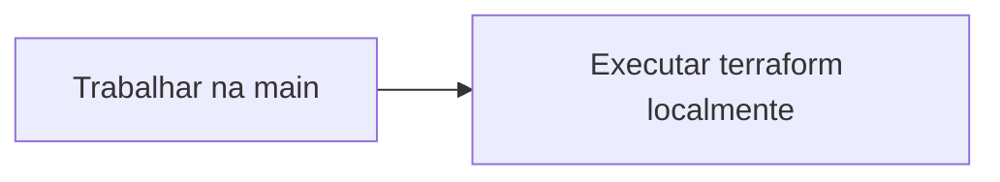
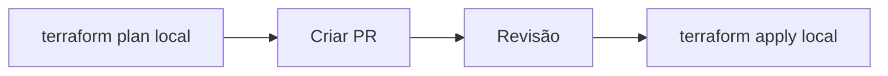
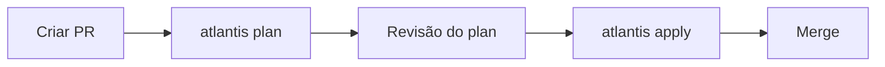

# Atlantis: Revolucionando a Colaboração com Terraform

## Introdução ao Atlantis

O Atlantis é uma ferramenta para colaboração com Terraform que foi desenvolvida na Hootsuite. A funcionalidade principal do Atlantis permite que desenvolvedores executem `terraform plan` e `apply` diretamente de pull requests do Terraform. O Atlantis então comenta de volta no pull request com a saída dos comandos.

Esta é uma funcionalidade simples, porém teve um efeito significativo na forma como a equipe da Hootsuite trabalha com Terraform. Ao trazer um workflow de Terraform para pull requests, o Atlantis ajudou a equipe de Ops da Hootsuite a colaborar melhor com Terraform e também permitiu que toda a equipe de desenvolvimento da empresa escrevesse e executasse Terraform com segurança.

## Problemas que o Atlantis Resolve

O Atlantis foi construído para resolver dois problemas que surgiram na Hootsuite conforme a empresa adotava o Terraform:

### 1. Colaboração Efetiva

**Qual é a melhor maneira de colaborar com Terraform em um ambiente de múltiplas equipes?**

### 2. Desenvolvedores Escrevendo Terraform

**Como permitir que desenvolvedores escrevam e apliquem Terraform com segurança?**

## Colaboração Efetiva

Ao escrever Terraform, há uma série de workflows que você pode seguir. O workflow mais simples é usar apenas a branch main:



Neste workflow, a equipe trabalhava na main e executava o terraform localmente. O problema com este workflow é que não havia colaboração ou revisão de código. Então a Hootsuite começou a usar pull requests:



Na Hootsuite, ainda executavam o `terraform plan` localmente e o funcionamento se dava da seguinte forma:

1. O desenvolvedor executava `terraform plan` localmente e revisava a saída.
2. Se estivesse satisfeito com as mudanças, criava um pull request para revisão.
3. Quando o pull request era aprovado, o desenvolvedor executava `terraform apply` localmente.

### Problemas do Workflow Tradicional

A Hootsuite observou que havia uma melhoria importante, mas ainda persistiam problemas:

#### Problema 1: Dificuldade de Revisão

A equipe da Hootsuite descobriu que era difícil revisar apenas o diff no pull request. Para revisar adequadamente uma mudança, era necessário ver a saída do `terraform plan`.

O que parece uma pequena mudança:

```terraform
resource "aws_instance" "web" {
- instance_type = "t2.micro"
+ instance_type = "t2.large"
}
```

Pode ter um plan grande:

```text
Plan: 1 to add, 1 to change, 1 to destroy.
```

#### Problema 2: Falta de atualização da Main

Na Hootsuite, trabalhando com git, era fácil a branch main ficar fora de sincronia com o que foi realmente aplicado. Isso podia acontecer se a equipe:

- Fizesse merge de um pull request sem executar apply
- O apply tivesse um erro no meio do caminho, esquecessem de corrigi-lo e então fizessem merge para main

Assim, o que estava na main não era realmente o que estava rodando em produção.

### A Solução do Atlantis

Com o workflow do Atlantis, a Hootsuite resolveu estes problemas:



Na nova abordagem da Hootsuite, ficou fácil revisar mudanças porque a equipe podia ver a saída do `terraform plan` no pull request.

**Pull requests são fáceis de revisar já que você pode ver o plan:**

```
atlantis plan
```

```
An execution plan has been generated and is shown below.
Resource actions are indicated with the following symbols:
  + create
  ~ modify
  - destroy

Terraform will perform the following actions:
  + aws_instance.web
      id:                           <computed>
      ami:                          "ami-2757f631"
      instance_type:                "t2.micro"
```

Também ficou fácil para a Hootsuite garantir que o pull request fosse executado com `terraform apply` antes de fazer merge para main porque a equipe podia ver a saída real do apply no pull request.

## Desenvolvedores Escrevendo Terraform

Na Hootsuite, o Terraform geralmente começou sendo usado pela equipe de Ops. Como resultado do uso do Terraform, a equipe de Ops da empresa se tornou muito mais rápida em fazer mudanças de infraestrutura, mas a maneira como os desenvolvedores solicitavam essas mudanças permanecia a mesma: eles usavam um sistema de tickets ou chat para pedir ajuda às operações, a solicitação ia para uma fila e depois Ops respondia que a tarefa estava completa.

Logo, porém, a equipe de Ops da Hootsuite começou a perceber que era possível para desenvolvedores fazer algumas dessas mudanças de Terraform eles mesmos! Alguns problemas surgiram:

### Problemas Tradicionais

1. **Credenciais**: Desenvolvedores não têm as credenciais para realmente executar comandos Terraform
2. **Revisão**: Se você der credenciais a eles, é difícil revisar o que está realmente sendo aplicado

### Solução com Atlantis

Com o Atlantis, a Hootsuite resolveu estes problemas. Todos os comandos `terraform plan` e `apply` passaram a ser executados do pull request. Isso significou que desenvolvedores não precisavam mais ter credenciais para executar Terraform localmente.

Claro, isso poderia ser perigoso: como a empresa poderia garantir que desenvolvedores (que poderiam ser novos no Terraform) não estivessem aplicando coisas que não deveriam? A resposta da Hootsuite foram revisões de código e aprovações.

Como o Atlantis comenta de volta com a saída do plan diretamente no pull request, ficou fácil para um engenheiro de operações da Hootsuite revisar exatamente quais mudanças seriam aplicadas. E o Atlantis podia rodar em modo require-approval, que requeria uma aprovação de pull request do GitHub antes de permitir que apply fosse executado.

### Resultados na Hootsuite

Com o Atlantis, os desenvolvedores da Hootsuite se tornaram capazes de escrever e aplicar Terraform com segurança. Eles passaram a submeter pull requests, podiam executar `atlantis plan` até sua mudança parecer boa e então obter aprovação de Ops para aplicar.

**Desde a introdução do Atlantis na Hootsuite, a empresa teve 78 colaboradores em seus repositórios Terraform, 58 dos quais eram desenvolvedores (75%).**

## Onde a Hootsuite Chegou

Desde a introdução do Atlantis na Hootsuite, a empresa cresceu para 144 repositórios Terraform [1] que gerenciam milhares de recursos Amazon. O Atlantis passou a ser usado para cada mudança de Terraform em toda a organização.

## Começando com o Atlantis

Para experimentar o Atlantis para sua equipe, você pode fazer um teste rápido localmente [https://www.runatlantis.io/guide/testing-locally.html](https://www.runatlantis.io/guide/testing-locally.html)

## Usando Ngrok para Testar Localmente

Crie uma conta gratuita no Ngrok e obtendo um token de autenticação. Ele permitirá que você exponha seu servidor Atlantis local para a internet, permitindo que o GitHub ou outro serviço envie webhooks para ele.

Após a instalação, autentique seu ngrok com o token que você recebeu ao criar sua conta:

```bash
ngrok config add-authtoken your-token-here
```

E inicie o túnel:

```bash
ngrok http 80
```

## Configurando o Atlantis

### Criando um Webhook

Acesse https://www.random.org/strings/ e gere uma string aleatória. Iremos precisar dela para configurar o webhook do GitHub.

No GitHub, vá para as configurações do seu repositório e crie uma nova secret chamada `NGROK_URL`. O valor deve ser a URL do túnel ngrok que você iniciou (por exemplo, `http://12345678.ngrok.io/events`).

Não esqueça o `/events` no final da URL. E o Content Type deve ser `application/json`. O Secret deve ser a string aleatória que você gerou.

Você também precisa escolher quais eventos o webhook deve escutar. Selecione apenas "Pull request reviews", "Issue Comments", "Pull requests" e "Pushes".

Ah, o Atlantis recomenda a criação de um usuário de bot no GitHub para que o Atlantis possa comentar nos pull requests e um token de acesso pessoal para autenticação. A única permissão necessária é `repo`. Como esse teste não é produtivo, você pode usar seu próprio usuário e token.

## Iniciando o Servidor Atlantis

Utilize o Docker para iniciar o servidor Atlantis:

```bash
docker run -it -p 80:4141 ghcr.io/runatlantis/atlantis:latest bash
```

Dentro do container iniciaremos o servidor:

```
atlantis server \
--atlantis-url="$URL" \
--gh-user="$USERNAME" \
--gh-token="$TOKEN" \
--gh-webhook-secret="$SECRET" \
--repo-allowlist="$REPO_ALLOWLIST"
```

Ainda existem muitas outras flags que você pode usar para configurar o Atlantis. Veja a [documentação](https://www.runatlantis.io/docs/server-configuration.html) para mais detalhes.

Após a inicialização precisamos dar as permissões necessárias para o Atlantis, por exemplo, conseguir realizar clones dos repositórios e interagir com o cloud provider.

No container gere uma chave SSH:

```bash
ssh-keygen 
```

Assim criamos dentro de /home/atlantis/.ssh/ a chave privada id_rsa e a chave pública id_rsa.pub. Agora utilizaremos o `ssh-keyscan` para adicionar o host do GitHub:

```bash
ssh-keyscan github.com >> /home/atlantis/.ssh/known_hosts
```

Isso permitirá que o Atlantis conheça o host do GitHub. Copie o conteúdo da chave pública (id_rsa.pub) e adicione como uma nova chave SSH nas configurações do GitHub.

Agora precisamos garantir que o Atlantis tenha acesso ao cloud provider. No caso da AWS, podemos criar um usuário com permissões administrativas e gerar um par de chaves de acesso. Dentro do container, exporte as variáveis de ambiente:

```bash
export AWS_ACCESS_KEY_ID=your-access-key-id
export AWS_SECRET_ACCESS_KEY=your-secret-access-key
```

Adicione essas variáveis as secrets do repositório no GitHub. O teste completo pode ser visto no repositório [projeto alpha](https://github.com/descomplicando-terraform/projeto_alpha/pull/21).


## Conclusão

O Atlantis transformou a maneira como equipes trabalham com Terraform, democratizando o acesso à infraestrutura enquanto mantém segurança e controle. É uma ferramenta essencial para qualquer organização que queira escalar suas práticas de Infrastructure as Code.

---

**Referências:**

- [1] Este conteúdo é baseado no post original de 11 de setembro de 2017 - Post original: <https://medium.com/runatlantis/introducing-atlantis-6570d6de7281>

**Links Úteis:**

- 🌐 Site oficial: <https://www.runatlantis.io/>
- 📚 Documentação: <https://www.runatlantis.io/docs/>
- 🐙 GitHub: <https://github.com/runatlantis/atlantis>

